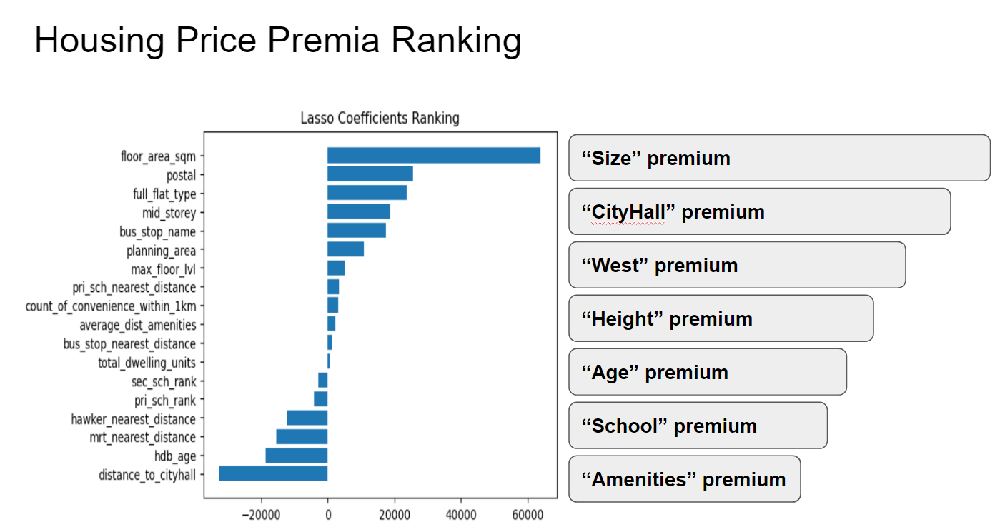

#  

# Project 2: Predicting HDB Resale Prices of Singapore

### Overview

The Housing and Development Board (HDB) in Singapore switched the resale housing price index to market forces on 1 January 2013. Prior to this, the resale price index was pegged to a formula based on the median resale prices of the previous quarter, adjusted for inflation and other factors. The switch to market forces means that resale prices are now determined by market conditions, such as supply and demand, and are no longer tied to a fixed formula. This change was implemented in order to promote a more sustainable and stable housing market in Singapore. 

However, this also means that the resale prices will be more volatile and less predictable. 

### Problem Statement

A real estate agent company in Singapore would like to know how to advise clients on the appropriate prices to list their flats for resale, as well as help their buying clients accurately calculate their budget. 

They require a reproducible model to predict HDB resale prices based on available information about the flat characteristics, as well as to understand the key factors affecting pricing of resale flats.

---

### Datasets

#### Provided Data

There are three groups of datasets included in the [`data`](./data/) folder for this project. These contain the relevant features that describe the characteristics of each HDB resale flat transactions for the decade of 2012-2022.

1. **Original datasets** (*source:*  https://www.kaggle.com/competitions/dsi-sg-project-2-regression-challenge-hdb-price/data)
  
  * train.csv
  * test.csv  

2. **Cleaned datasets** - Missing data have been imputed/dropped from the Original datasets for use in this analysis

  * cleaned_train_set.csv
  * cleaned_test_set.csv
  * y_train.csv (contains the target variable 'resale_price' for model fitting which is saved separately after target-encoding of the training dataset)
  
3. **Encoded datasets** - Categorical features have been encoded and New features engineered as potential model inputs  

  * encoded_X_train.csv
  * encoded_X_test.csv   
  
4. **Kaggle Submission**  

  * kaggle_submission.csv (have the following format: Id, Predicted)   
  

#### Data Dictionary

For data dictionary of the Original datasets, please refer to *source* 

Below is the data dictionary for features in the Encoded datasets that have been "re-engineered" for modelling.
  
  
  
|Feature|Data Type|Unit|Description|
|:---|---|:---:|---|
|mid_storey|int64|Numeric|ordinally encoded from 1-22|
|average_dist_amenities|float64|Numeric|mean distance of the nearest distance to mrt, hawker, bus stop, primary school|
|count_of_convenience_within_1km|int64|Numeric|total count of market_hawker, multistorey_carpark, precinct_pavilion, mall_within_1km, hawker_within_1km, bus_interchange, mrt_interchange|
|house_coord|object|-|a tuple of the property's latitude, longitude|
|distance_to_cityhall|float64|Meters|geodistance of property to City Hall map coordinates|
|pri_sch_rank|int64|Numeric|primary schools ranked by vacancies when Rank 1=20-40, Rank 2=40-60, Rank 3=60 and above|
|sec_sch_rank|int64|Numeric|secondary schools ranked by cutoff when Rank 1=above 240, Rank 2=220 to 240, Rank 3=less than 220|
|pri_sch_rank_X_distance|float64|Meters|pri_sch_rank multiplied by pri_sch_nearest_distance|
|sec_sch_rank_X_distance|float64|Meters|sec_sch_rank multiplied by sec_sch_nearest_distance|
|flat_model_2-room|int64|Numeric|OneHotEncoded from flat_model where 1=Yes, 0=No|
|flat_model_Adjoined flat|int64|Numeric|OneHotEncoded from flat_model where 1=Yes, 0=No|
|flat_model_Apartment|int64|Numeric|OneHotEncoded from flat_model where 1=Yes, 0=No|
|flat_model_DBSS|int64|Numeric|OneHotEncoded from flat_model where 1=Yes, 0=No|
|flat_model_Improved|int64|Numeric|OneHotEncoded from flat_model where 1=Yes, 0=No|
|flat_model_Improved-Maisonette|int64|Numeric|OneHotEncoded from flat_model where 1=Yes, 0=No|
|flat_model_Maisonette|int64|Numeric|OneHotEncoded from flat_model where 1=Yes, 0=No|
|flat_model_Model A|int64|Numeric|OneHotEncoded from flat_model where 1=Yes, 0=No|
|flat_model_Model A-Maisonette|int64|Numeric|OneHotEncoded from flat_model where 1=Yes, 0=No|
|flat_model_Model A2|int64|Numeric|OneHotEncoded from flat_model where 1=Yes, 0=No|
|flat_model_Multi Generation|int64|Numeric|OneHotEncoded from flat_model where 1=Yes, 0=No|
|flat_model_New Generation|int64|Numeric|OneHotEncoded from flat_model where 1=Yes, 0=No|
|flat_model_Premium Apartment|int64|Numeric|OneHotEncoded from flat_model where 1=Yes, 0=No|
|flat_model_Premium Apartment Loft|int64|Numeric|OneHotEncoded from flat_model where 1=Yes, 0=No|
|flat_model_Premium Maisonette|int64|Numeric|OneHotEncoded from flat_model where 1=Yes, 0=No|
|flat_model_Simplified|int64|Numeric|OneHotEncoded from flat_model where 1=Yes, 0=No|
|flat_model_Standard|int64|Numeric|OneHotEncoded from flat_model where 1=Yes, 0=No|
|flat_model_Terrace|int64|Numeric|OneHotEncoded from flat_model where 1=Yes, 0=No|
|flat_model_Type S1|int64|Numeric|OneHotEncoded from flat_model where 1=Yes, 0=No|
|flat_model_Type S2|int64|Numeric|OneHotEncoded from flat_model where 1=Yes, 0=No|
|flat_type_1 ROOM|int64|Numeric|OneHotEncoded from flat_type where 1=Yes, 0=No|
|flat_type_2 ROOM|int64|Numeric|OneHotEncoded from flat_type where 1=Yes, 0=No|
|flat_type_3 ROOM|int64|Numeric|OneHotEncoded from flat_type where 1=Yes, 0=No|
|flat_type_4 ROOM|int64|Numeric|OneHotEncoded from flat_type where 1=Yes, 0=No|
|flat_type_5 ROOM|int64|Numeric|OneHotEncoded from flat_type where 1=Yes, 0=No|
|flat_type_EXECUTIVE|int64|Numeric|OneHotEncoded from flat_type where 1=Yes, 0=No|
|flat_type_MULTI-GENERATION|int64|Numeric|OneHotEncoded from flat_type where 1=Yes, 0=No|
|full_flat_type|float64|Singapore dollars|Target-encoded with resale price|
|postal|float64|Singapore dollars|Target-encoded with resale price|
|bus_stop_name|float64|Singapore dollars|Target-encoded with resale price|
|planning_area|float64|Singapore dollars|Target-encoded with resale price|

---  
     
### Exploratory Analysis

* Preliminary analysis of the original dataset showed that out of a total of 75 relevant features provided, location features including 'address', 'postal', 'bus_stop_name' ranked highest in the information scores against resale_price. Size features including 'floor_area_sqm' and 'full_flat_type' followed closely behind in relevance. Amenities such as 'precinct_pavilion', 'multistorey_carpark' and 'market hawker' ranked lowest.  
   

* Location features such as 'planning_area', 'postal' and 'bus_stop_name' revealed a "West premium" as locations in the West exhibited a significantly higher median resale price. However, target encoding using the mean of each category was required in order to extract the information value out of these three features.  
 
* Proximity to good schools is a bonus and not a primary driver of price determination as seen by the wide range of resale prices across schools of all standings.  
 
* A strong positive correlation exists between the max_floor_level of the flats and its resale price. The reason is because in areas such as the CBD area, land prices are more expensive and so developers needed to build taller in order to capitalize on it, inadvertently resulting in the strong correlation.   
 
* Density feature such as total_dwelling_units were not particularly useful as it is most likely that everywhere in Singapore is considered dense and so it is not a primary consideration to most homeseekers.  
 
* The older the HDB is, the lower its resale price tended to be.   
 
* The closer the flat is to city center ("City Hall"), the higher the resale price.    

 

### Feature Selection  

Features have been selected based on their correlations and mutual information scores with resale prices. Subsequently, they can be reclassified into four major factors that all buyers primarily look out for, namely, **Location, Size, Age, and Amenities**.  

In total, there are **18 selected features** that will be trained on in the models.
 
 
|Feature|Factor Category|Encoding Method|
|---|---|---|
|hdb_age|Age|-|
|floor_area_sqm|Size|-|
|full_flat_type|Size|Target-encoded|
|postal|Location|Target-encoded|
|bus_stop_name|Location|Target-encoded|
|distance_to_cityhall|Location|-|   
|planning_area|Location|Target-encoded| 
|mid_storey|Location|-|
|max_floor_lvl|Location|-|
|total_dwelling_units|Size, Location|-|   
|mrt_nearest_distance|Amenities, Location|-| 
|hawker_nearest_distance|Amenities, Location|-|
|bus_stop_nearest_distance|Amenities, Location|-|
|average_dist_amenities|Amenities, Location|-|   
|pri_sch_nearest_distance|Amenities, Location|-| 
|count_of_convenience_within_1km|Amenities|-| 
|pri_sch_rank|Amenities|Ordinal-encoded|  
|sec_sch_rank|Amenities|Ordinal-encoded|

  
 

### Model Fitting and Evaluation  

* Ordinary Linear Regression ("OLS"), RidgeCV Regression and LassoCV Regression models have been used to predict the resale price given a set of flat characteristics.        
 
  
* All features have been standard-scaled to improve the performnance of modeling although standard-scaling did not have any effect on the basic OLS model.  
 
* Beyond a certain number of features and degree of polynomials, the model's accuracy performance ceased to improve meaningfully. The optimal model which produced the lowest root-mean-squared-error ("RMSE") was found to be the one with a set of 18 features and raised to a polynomial degree of four that encompasses the gamut of interaction terms comprising of the four major factors of location, size, amenities and age.
 
* With virtually similar RMSE between the training, baseline and Kaggle testing datasets, all variations of the models have no signs of overfitting. Therefore, both RidgeCV and LassoCV were not able to deliver improvements on the optimal model of 18 features.     
 

### Model Results Benchmarking
 

|Model|Std.Scaled|Num_of_Features|training_RMSE|baseline_RMSE|RidgeCV_RMSE|LassoCV_RMSE|Polynomial_4_train_RMSE|Polynomial_4_baseline_RMSE|Num_of_Poly_Features|Recommended
|---|---|---|---|---|---|---|---|---|---|---|
|1|	Yes|	14|	\$ 55,260|	\$ 54,975|	\$55,240|	\$55,261|	\$ 38,779|	\$ 38,216|	3,060|	
|2|	Yes|	15|	\$ 54,877|	\$ 54,641|	\$ 54,855|	\$ 54,877|	\$ 37,693|	\$ 37,654|	3,876|	
|3|	Yes|	16|	\$ 54,855|	\$ 54,624|	\$ 54,833|	\$ 54,855|	\$ 37,671|	\$ 37,758|	4,845|	Yes|
|4|	Yes|	18|	\$ 54,860|	\$ 54,630|	\$ 54,834|	\$ 54,859|	\$ 37,760|	\$ 37,766|	7,315|	
|5|	Yes|	21|	\$ 54,849|	\$ 54,609|	\$ 54,821|	\$ 54,849|	n/a|	n/a|	n/a|	
|6|	Yes|	28|	\$ 54,571|	\$ 54,314|	\$ 54,550|	\$54,571|	n/a|	n/a|	n/a|	

---

  
    
 
 

### Model Limitations  

* Trained only on historical data from 2012-2022. Model will need to be retrained on the latest data again if market regime changes drastically. 

* The Simple model with just 18 features does not capture sufficient value-add from feature interaction.

* The Complex polynomial model is unintuitive and unwieldy with 7,315 features despite its accuracy.

* Model can only capture 80-90% of price variation meaning clients will still have 10-20% buffer with which they will need to budget for.

### Conclusions and Recommendations

* Location is not King! SIZE IS KING!
 
* Size > Location > Age > Amenities
 
* Locations closer to city centre (“City Hall”) are more expensive and taller!
 
* Locations in the West tend to command a higher premium
 
* Among the Amenities, proximity to MRT has the biggest premium
 
* Proximity to good schools is a bonus, not a primary consideration for most
   

---

