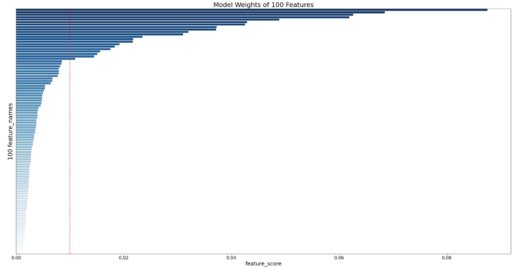
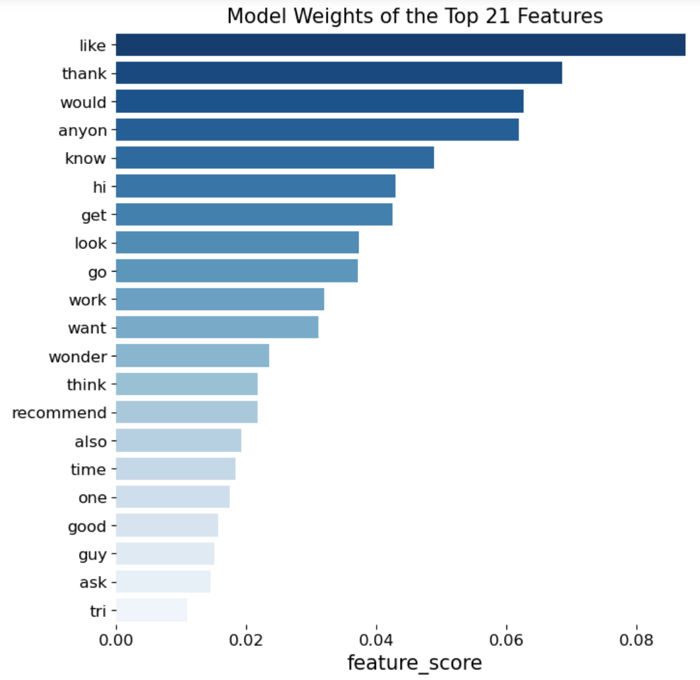

#  

# Project 3: Subreddit Classification using NLP Models

### Overview

The objective of this project is to derive a Natural Language Processing ('NLP') model that is able to accurately parse and classify posts from two highly similar subreddits into their respective subreddit.  
  
Various tools of text preprocessing and estimator models will be tested for the best results.  
  
Two local subreddits **r/Singapore** and **r/askSingapore** have been selected due to their strong overlap of similiarities.  

r/Singapore is the biggest and most active subreddit for Singaporeans with 589k members where locals chat, ask, and complain about anything under Singapore's sun. The subreddit was created in Jan 26, 2008.  

r/askSingapore is a more niche local subreddit for people to ask the community about anything related to work/leisure/etc in Singapore. It has a much smaller community with just 121k members and was created in Jan 26, 2015. 

### Problem Statement

There is a large degree of overlap between r/Singapore and r/askSingapore subreddits. Questions which should technically be asked in r/askSingapore get asked in r/Singapore as well due to its wider community in the latter. Consequently, it can be difficult to correctly predict which subreddit a particular question post belonged to. 

---

### Datasets

#### Provided Data

There are three datasets included in the [`datasets`](./datasets/) folder for this project. These contain the subreddit posts from each of the two classes, r/Singapore and r/askSingapore. The latest set of posts have been web-scraped from Reddit.com using PushShift Reddit API on March 8, 2023. Depending on the activity within each subreddit, these posts may not be be within the exact same timeframe.  

1. **singapore.csv** - Contains 10,000 posts from r/Singapore  
        - Headers: subreddit, selftext, title

2. **askSingapore.csv** - Contains 10,000 posts from r/askSingapore  
        - Headers: subreddit, selftext, title
  
3. **cleaned_reddit_posts.csv** - Posts from the two subreddits combined in 50:50 proportions and pre-processed for EDA and modeling  
        - Headers: subreddit, selftext, title, all_text, clean_text, subreddit_label  
                -  all_text: title and selftext combined  
                - clean_text: processed all_text using BeautifulSoup, regex, nltk packages  
                - subreddit_label: label encoding of subreddit where r/Singapore=0 and r/askSingapore=1  
                
  
---  
     
### Exploratory Analysis

***Character Count and Word Count***  
In titles alone, r\askSingapore tends to have a much tighter distribution of word and character counts than r\Singapore. This is likely due to its more specific genre which mostly involves formatting your post as a question. 

***Sentiment Analysis***  
In titles alone, r/askSingapore shows a slightly more positive tone with a compound score of +0.06 versus a score of +0.03 for r/Singapore. However, when _all_text_ (titles+selftext) are assessed, the positive tone of r/askSingapore beomes more apparent with a score of +0.32 versus +0.07 for r/Singapore.  

***Common Words***  
An analysis of the most common words in all_text between the classes revealed that there are a total of 754 words (in their stemmed and lemmatized forms) common to both r/Singapore and r/askSingapore. Out of these, 111 words have been found by hypothesis testing to have the same mean frequency of occurrences which suggest that these words can potentially be removed as additional stopwords since they are unlikely to provide informational value and will only add noise to our models that rely on word-counting to represent the word tokens. 

### Model Selection Methodology  

* Five different classification models from scikit-learn will be trained on the data which includes MultinomialNaiveBayes(NB), LogisticRegression(LR), kNearestNeighbors(kNN), SupportVectorMachine(SVM), and RandomForestClassifer(RF).  

* Each of these models will also be paired first with CountVectorizer and TF-IDF Vectorizer to tokenize and make a count of the most important word tokens.  

* GridSearchCV will also be used to optimize for the best set of hyperparameters for each model.

* The best model will then be selected based on the best 'Accuracy Score'. 

### Model Results Benchmarking  
  
  
|Model|Accuracy Score*|Number of Features|Selected|
|---|---|---|---|
|kNN_tvec|70%|100|
|kNN_cvec|71%|100|
|NaiveBayes_cvec|72%|3,000|
|NaiveBayes_tvec|73%|3,000|
|SVM_cvec|75%|4,000|
|RandomForest_cvec|77%|100|
|LogisticRegression_tvec|78%|3,000|
|SVM_tvec|79%|100|
|RandomForest_tvec|79%|100|Yes|
|LogisticRegression_cvec|80%|4,000|  

_*accuracy score=average of train+test scores_  
_tvec - TF-IDF Vectorizer_  
_cvec - Count Vectorizer_
  
  

### Best Model Evaluation  

#### TF-IDF Vectorization with RandomForestClassifier 

* A reasonably good accuracy score of 80% with just 100 features is the basis for choosing this model over the others.  

* With a precision score ('true positive rate') of 81%, the model is great at classifying posts into r/askSingapore however there is also slightly higher tendency for it to call false negatives (i.e. misclassifying r/askSingapore posts as r/Singapore). The reason is because r/askSingapore is more like a subset of the broader r/Singapore and therefore, there are many questions being posted in r/Singapore as well which muddles the model's classification.  

* Among the 100 features used in the model, the top 21 features accounted for 73% of the total weight of features' importance. Given that the model's has an average accuracy score of 80%, this means that 58% of its accuracy is attributable to just the 21 words alone.  

  
  
  
    
    
  
  
    
    
* Exploring further, we can see that most of the top 21 word features can be generally classified into two semantic categories:  
    ***1) Positive words***  
        Polite words such as "hi, anyon, thank" and positive-sentiment words such as "recommend, wonder, good" have been overweighted.  
    ***2) Questioning words***  
        Words commonly associated with asking of questions such as "anyon, get, know, look, want, recommend, ask" have also been overweighted.  
      
* This further corroborates our EDA's findings that posts in r/askSingapore tend to be significantly more positive in tone than r/Singapore which is why the model has been able overweighting the presence of such words to give a more accurate classification.  

### Conclusions and Recommendations

* Use TF-IDF Vectorizer + RandomForestClassifier for the best accuracy and interpretability  

* Highly simple: just 100 features only  

* Highly accurate: accuracy score of 80% both in-sample and out-sample whch suggests an absence of overfitting.  

* Highly relevant: top 21 features alone contributed ~60% toward the model's total accuracy.  

* Be careful of its slightly higher tendency to misclassify False Negatives if one subreddit is a subset of another. 
